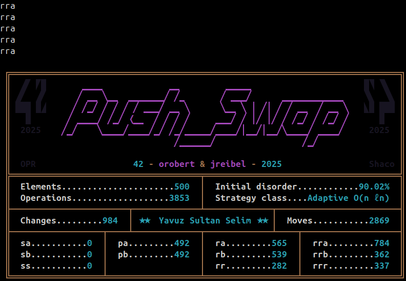
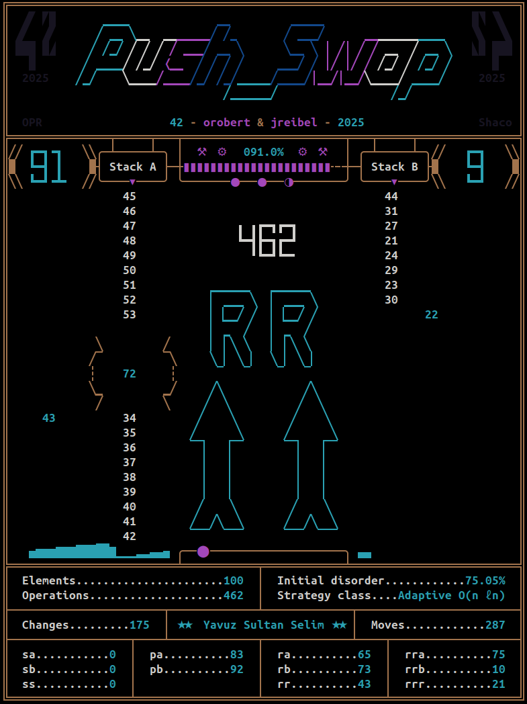
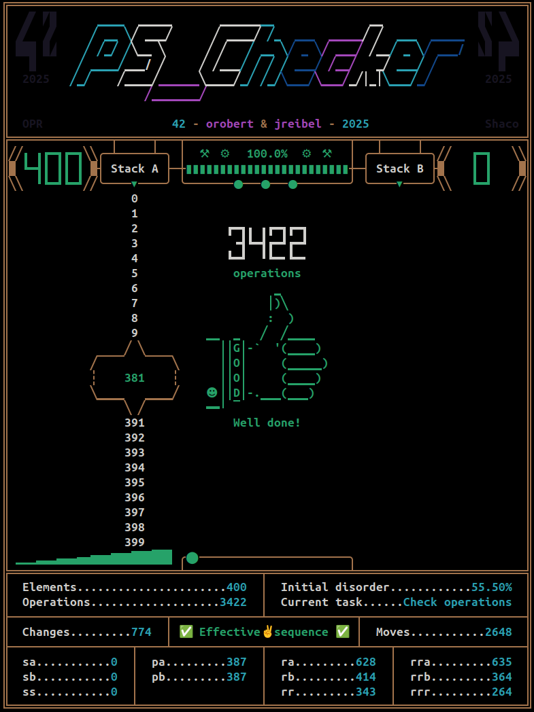
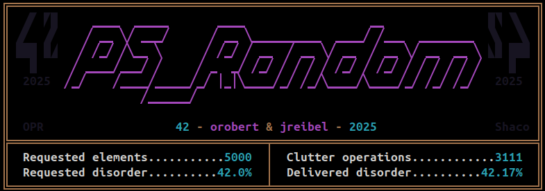
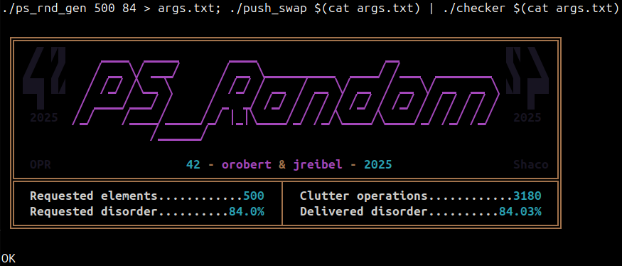
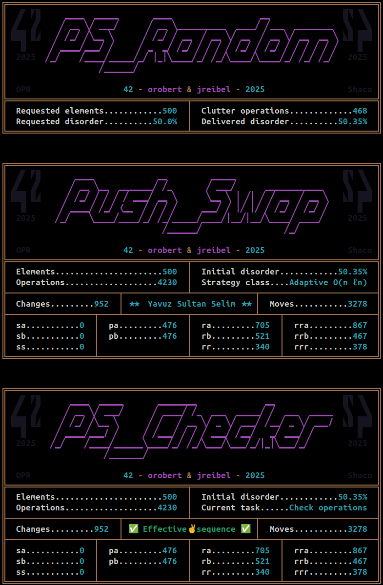

_This project has been created as part of the 42 curriculum by **orobert** & **jreibel**._


$${\color{teal}⋘⊛⋙}$$
# **$${\color{orange}1. \space Description}$$**
The **Push_Swap** project aims to sort a set of unsorted integers, using a minimal number of predefined basic instructions.
## **$${\color{violet}1.1. \space Operating \space framework}$$**
Let's use two stacks, **A** and **B**. At the beginning of the process, all unsorted integers are inside **Stack A** and **Stack B** is empty.\
When the process is complete, **Stack A** must contain all integers in ascending order, the smallest value being at the top, and **Stack B** must be empty.
## **$${\color{violet}1.2. \space Basic \space instructions}$$**
11 basic instructions can be used to achieve this sort :

- **sa** swaps the two top values of **Stack A**
- **sb** swaps the two top values of **Stack B**
- **ss** performs **sa** and **sb** at the same time
- **pa** pushes the top value of **Stack B** to the top of **Stack A**, if any
- **pb** pushes the top value of **Stack A** to the top of **Stack B**, if any
- **ra** rotates **Stack A** upwards, top value goes to bottom
- **rb** rotates **Stack B** upwards, top value goes to bottom
- **rr** performs **ra** and **rb** at the same time
- **rra** rotates **Stack A** downwards, bottom value goes to top
- **rrb** rotates **Stack B** downwards, bottom value goes to top
- **rrr** performs **rra** and **rrb** at the same time
## **$${\color{violet}1.3. \space Expected \space result}$$**
By default, the _push_swap_ program must check if all provided arguments are valid, then print the sequence of basic instructions able to sort the provided integer list.\
It can also display a _benchmark_ panel summarizing the performed operations to achieve the sort.


$${\color{teal}⋘⊛⋙}$$
# **$${\color{orange}2. \space Additional \space parts}$$**
To improve the use and development of the **Push_Swap** project, we wish to provide two additional programs :
## **$${\color{violet}2.1. \space Bonus \space part, \space the \space Checker}$$**
By default, the **Checker** program takes the same set of disordered integers as **Push_Swap**, and receives the **Push_Swap** basic instructions to sort them.\
It will then execute the given instructions on the integers set, then print "**OK**" if it is successfull. Else, it will print "**KO**".
## **$${\color{violet}2.2. \space Free \space initiative, \space the \space Random \space Generator}$$**
As the Linux tool _shuf_ tends to generate integer sets with around 50% disorder, we needed a more specific disorder generator.\
You just need to tell the **PS_Rnd_Gen** the amount of integers and the minimal level of disorder you want, and Voila!
$${\color{teal}⋘⊛⋙}$$
# **$${\color{orange}3. \space Sorting \space Algorithms}$$**
We needed to code four sorting algorithms, one for each academic complexity class (_O(n²)_, _O(n √n)_ and _O(n log n)_), and one of our own that could operate on each complexity class depending on the measured input disorder.
## **$${\color{violet}3.1. \space O(n²), \space the \space Cocktail \space Shaker \space sort}$$**
It goes through the list many times and inverts each misplaced pair of neighbors.\
Bidirectional variant of the basic Bubble sort, the **Cocktail Shaker** is easy to implement and efficient on lower disorder sets.
## **$${\color{violet}3.2. \space O(n \space √n), \space the \space Dynamic \space Chunk \space sort}$$**
It goes through the list a few times, keeps a small amount of integers and sends the rest to **Stack B**, starting with the smallest ones. It then takes it all back to **Stack A**, **Stack B** being almost reverse-sorted.\
The **Dynamic Chunk** is based on increasing-value chunks like classic Chunk sort, but is more versatile and pushes back in one time, so it's an efficient medium-complexity algorithm when you only have two storage areas, namely **Stack B**'s top and bottom.
## **$${\color{violet}3.3. \space O(n \space log \space n), \space the \space Radix \space base2 \space sort}$$**
The **Radix base2** goes through the list a few times and sends integers to **Stack B** depending on their active bytes, starting by the weakest one. It then takes **Stack B** to **Stack A**, and continues with the next byte.\
The quantity of operations needed by this algorithm depends only of the quantity of integers to sort, so its performance is highly predictable.
## **$${\color{violet}3.4. \space The \space Yavuz \space Sultan \space Selim \space sort}$$**
Named after a Turkish sultan known for being greedy, our **Yavuz Sultan Selim** sort is based on the Turk sort for its return from **Stack B** to **Stack A**, always choosing to push back the value requiring the least amount of moves.
To push values to **Stack B**, its strategy depends on the measured disorder :
- below 20%, it keeps only ascending sequence from one to one on **Stack A**, and pushes the remaining values in a single pass.
- between 20% and 50%, it pushes to **Stack B** like the Dynamic Chunk described above.
- beyond 50%, it determines a small LIS (_Longest Increasing Subsequence_) and pushes the rest to **Stack B** using a median pivot, separating the smaller and the bigger values.\
The efficiency of each push-to-B behavior matches the required complexities, and the greedy return to A allows this custom algorithm to achieve sorting with a low amount of operations, matching the excellence performance rating.
$${\color{teal}⋘⊛⋙}$$
# **$${\color{orange}4. \space Instructions}$$**
Each program can be generated using the **Make** tool. From the project root folder, type :
- _make_, or _make re_, to compile the "**push_swap**" program
- _make bonus_ to compile the "**checker**" program
- _make gen_ to compile the "**ps_rnd_gen**" program
## **$${\color{violet}4.1. \space Running \space push\_swap}$$**
**push_swap** always takes an unsorted list of integers as an argument. You can type them, or write them inside a file and make it be read as an argument :
```
./push_swap 3 5 8 1 2 0 9 7

./push_swap "3 5 8 1" 2 "0 9" 7

./push_swap $(cat args.txt)
```
When no other argument is provided, it will sort the integers using the **Sultan** algorithm and print the instructions sequence able to do so.
push_swap can also be run with some algorithm flags :
- _--simple_ forces the use of the _O(n²)_ algorithm
- _--medium_ forces the use of the _O(n √n)_ algorithm
- _--complex_ forces the use of the _O(n log n)_ algorithm
- _--adaptive_ forces the use of the _Sultan_ algorithm (same as no algorithm flag)
- _--custom_ forces the use of the _Sultan_ algorithm as if it was in the _disorder>50%_ scenario

Furthermore, there is some visualization flags :
- _--bench_ displays the instruction sequence, then a panel describing what has been done
- _--benchview_ does not display the instruction sequence, but shows the evolution of each stack and the instructions count in real-time
- _--benchanim_ does not display the instruction sequence, but shows the evolution of each stack and the movement of each value in real-time during the resolution process\
_**The** _--benchview_ **and** _--benchanim_ **modes are NOT subject-compliant and can ONLY serve testing and educational purposes.**_
```
./push_swap 3 5 8 1 2 0 9 7 --bench

./push_swap <unsorted integers> --bench --medium

./push_swap --benchview $(cat args.txt)

./push_swap <some integers> --custom <more integers> --benchanim <even more integers>
```
Any incorrect argument or conflicting flags will lead the program to just write "**Error**" and exit.


## **$${\color{violet}4.2. \space Running \space checker}$$**
**Checker** is designed to work with **push_swap** and will take the same unsorted integers list as an argument. Providing another list will almost always lead to incorrect interpretation of the further instructions, but could be useful to test the "**KO**" output.
```
./checker 3 5 8 1 2 0 9 7

./checker $(cat args.txt)
```
It will then read the instructions on the standard input. If used alone, the standard input is the keyboard and this program could turn into an unfunny memory game.\
But it is wiser to use it with the **push_swap** program :
```
./push_swap $(cat args.txt) | ./checker $(cat args.txt)

./push_swap $(cat args.txt) --bench > seq.txt; cat seq.txt | ./checker $(cat args.txt)
```
As **push_swap**, the **checker** program can handle some visualization flags :
- _--bench_ displays a panel describing what has been done, and if it is successfull
- _--benchview_ shows the evolution of each stack and the instructions count in real-time, and the final result
- _--benchanim_ shows the evolution of each stack and each value moving in real-time during the resolution process, and the final result\
**push_swap** and **checker** flags can be combined to check consistency.

_**The** _--bench_, _--benchview_ **and** _--benchanim_ **modes are NOT subject-compliant and can ONLY serve testing and educational purposes.**_

```
./push_swap $(cat args.txt) | ./checker $(cat args.txt) --benchview

./push_swap $(cat args.txt) --bench | ./checker --bench $(cat args.txt)

./push_swap $(cat args.txt) --simple | ./checker $(cat args.txt) --benchanim
```

## **$${\color{violet}4.3. \space Running \space ps\_rnd\_gen}$$**
Run alone, the random generator needs two parameters : the amount of integers to generate, and the wanted minimal disorder. 0 is perfectly sorted, 100 is reverse order.\
It will then display the generated integers, one per line, then a panel showing what has been done and not included into a file, if redirected to.
```
./ps_rnd_gen 100 20
./ps_rnd_gen 500 80 > args.txt
```

## **$${\color{violet}4.4. \space Running \space all \space three \space programs \space together}$$**
Designed to work together, you can launch the complete process with commands like this :
```
./ps_rnd_gen 500 60 > args.txt; ./push_swap $(cat args.txt) | ./checker $(cat args.txt)

./ps_rnd_gen 500 95 > args.txt; ./push_swap $(cat args.txt) --custom --bench | ./checker $(cat args.txt) --bench

./ps_rnd_gen 100 15 > args.txt; ./push_swap $(cat args.txt) | ./checker $(cat args.txt) --benchanim
```

## **$${\color{violet}4.5. \space Lauching \space a \space complete \space test, \space the \space easiest \space way}$$**
A **fulltest** rule has been included inside the _Makefile_, making testing easy.\
By default, it creates each binary, generates 500 integers with 50% of disorder, and runs each program with the _--bench_ flag.\
You can change these values and flags at will.
```
make fulltest

make fulltest QTY=1337 DIS=42

make fulltest QTY=100 DIS=60 ALGO=--adaptive BENCH=anim
```

$${\color{teal}⋘⊛⋙}$$
# **$${\color{orange}5. \space Contributors}$$**
- **orobert** aka **_OPR_**\
    _project's mainframe and additional programs_
- **jreibel** aka **_Shaco_**\
    _sorting algorithms_
- **ChatGPT**\
    _UTF-8 support and random generation_
- **Students** from **School 42 Mulhouse**\
    _brainstorming, coffee and moral support_
$${\color{teal}⋘⊛⋙}$$
# **$${\color{orange}6. \space Resources}$$**
- Sorting algorithms
    https://en.wikipedia.org/wiki/Sorting_algorithm
- Big O notation
    https://en.wikipedia.org/wiki/Big_O_notation
- About Turk algorithm, by 42 student Yutong Deng
    https://pure-forest.medium.com/push-swap-turk-algorithm-explained-in-6-steps-4c6650a458c0
- About LIS
    https://www.geeksforgeeks.org/dsa/longest-increasing-subsequence-dp-3/
$${\color{teal}⋘⊛⋙}$$
# **$${\color{magenta}Thanks \space for \space your \space time}$$**
$${\color{teal}⋘⊛⋙}$$

###### $${\color{darkgrey}_i\space_f\space\space\space_y\space_o\space_u\space\space\space_c\space_a\space_n\space\space\space_r\space_e\space_a\space_d\space\space\space_t\space_h\space_i\space_s\space_,\space\space\space_y\space_o\space_u\space\space\space_d\space_o\space_n\space_`\space_t\space\space\space_n\space_e\space_e\space_d\space\space\space_g\space_l\space_a\space_s\space_s\space_e\space_s\space_.}$$

